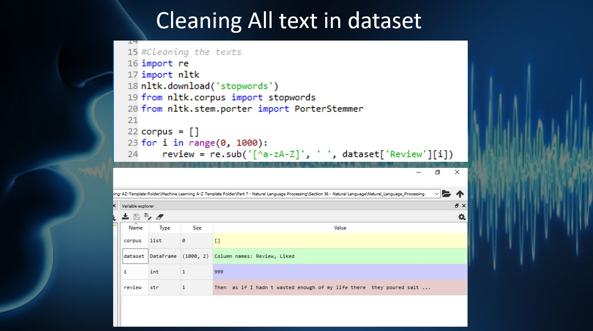
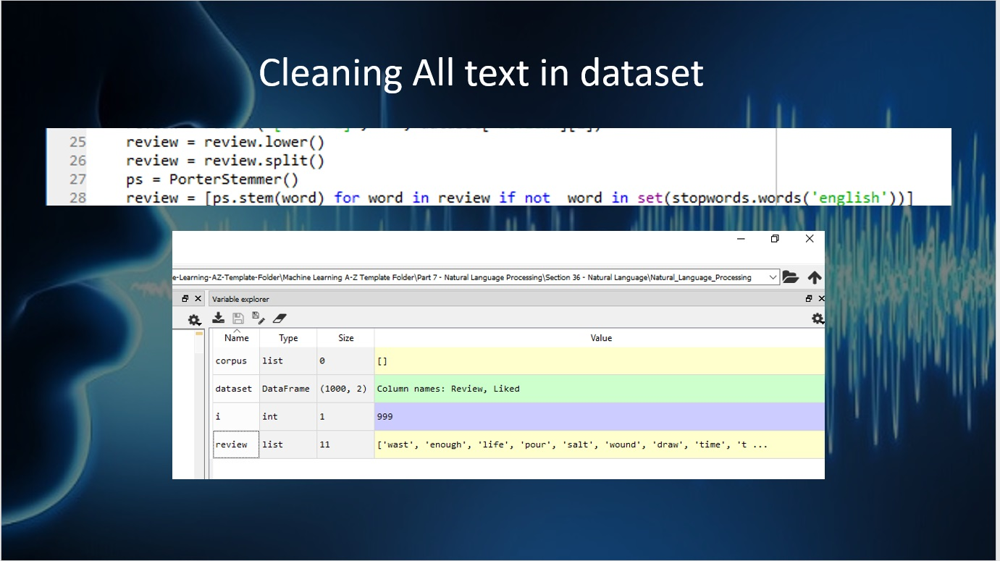
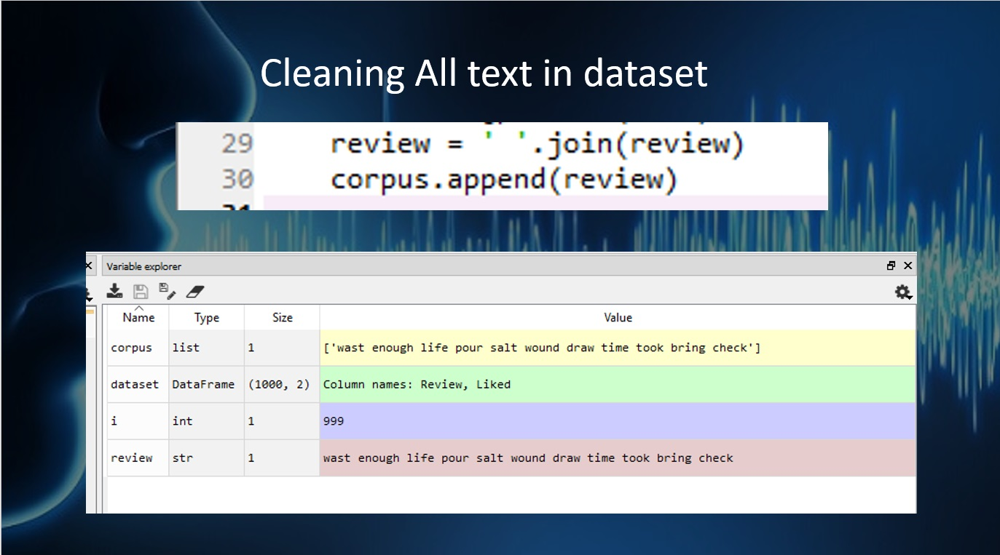
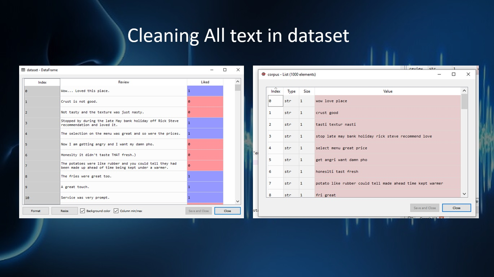
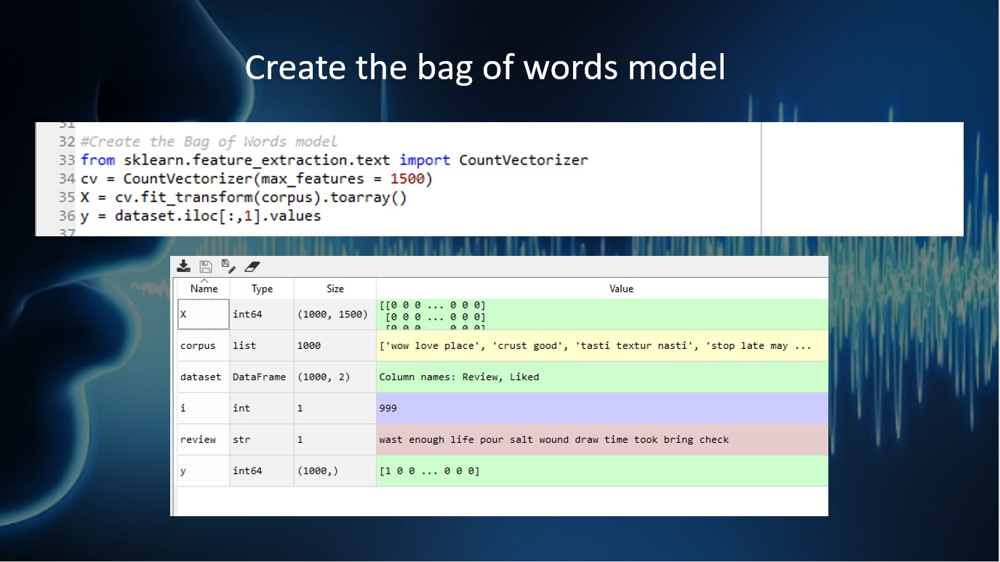
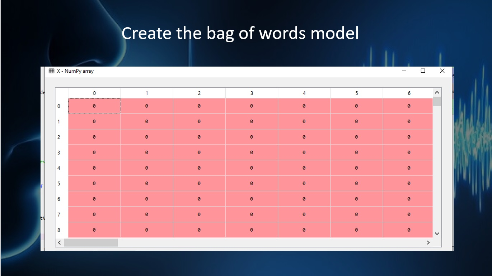
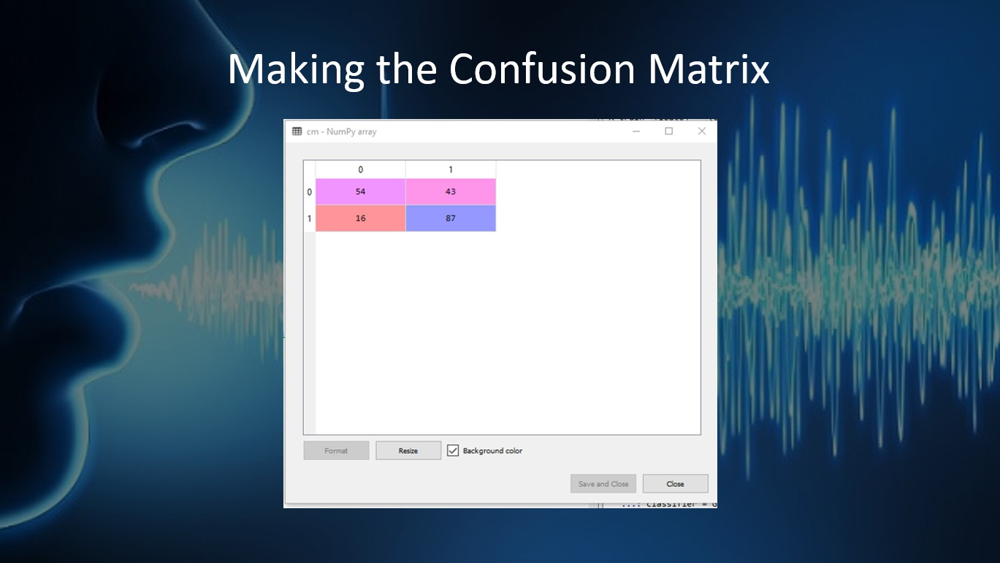

```python
# Natural Language Processing

# Importing the libraries
import numpy as np
import matplotlib.pyplot as plt
import pandas as pd
```

This is simple Library that I alway import first in every project. Because it cover all basic coding. 
* numpy for mathmatic
* matplotlib for ploting 
* pandas for data analysis


```python
# Importing the dataset
dataset = pd.read_csv('Restaurant_Reviews.tsv', delimiter = '\t', quoting = 3)
```


```python
dataset.head()
```


```python
dataset.tail()
```

-We use 1000 dataset about"Restaurant comment"


```python
# Cleaning the texts
import re
import nltk
nltk.download('stopwords')
from nltk.corpus import stopwords
from nltk.stem.porter import PorterStemmer
corpus = []
```

* We import re for let machine learn about "symbal and special Charecter"
* We import nltk for use "Natural language tool kit"


```python
for i in range(0, 1000):
    review = re.sub('[^a-zA-Z]', ' ', dataset['Review'][i])
    review = review.lower()
    review = review.split()
    ps = PorterStemmer()
    review = [ps.stem(word) for word in review if not word in set(stopwords.words('english'))]
    
```

* in 1000 sentense we change it to lower charecter by"review = review.lower()"
* And split all of word by "review = review.split()"
* "ps = PorterStemmer()
   review = [ps.stem(word) for word in review if not word in set(stopwords.words('english'))]"
   This two line we use for delete unnescessery word 






```python
    review = ' '.join(review)
    corpus.append(review)
```

* Join all sentence again and review line by line







```python
# Creating the Bag of Words model
from sklearn.feature_extraction.text import CountVectorizer
cv = CountVectorizer(max_features = 1500)
X = cv.fit_transform(corpus).toarray()
y = dataset.iloc[:, 1].values
```

* create the bag of word for containt all word in sentense (1500 word maximum)







```python
# Splitting the dataset into the Training set and Test set
from sklearn.cross_validation import train_test_split
X_train, X_test, y_train, y_test = train_test_split(X, y, test_size = 0.20, random_state = 0)
```

* split all word in X train,Y train,X test and Y test


```python
# Fitting Naive Bayes to the Training set
from sklearn.naive_bayes import GaussianNB
classifier = GaussianNB()
classifier.fit(X_train, y_train)

# Predicting the Test set results
y_pred = classifier.predict(X_test)

# Making the Confusion Matrix
from sklearn.metrics import confusion_matrix
cm = confusion_matrix(y_test, y_pred)
```




```python

```
